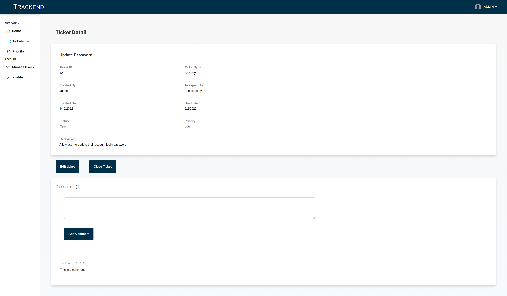

# Trackend


Built a CMS (Content Management System) style [Issue Tracker](https://trackend-project.herokuapp.com/) that tracks bugs and issues through a ticketing system. Users can submit and comment on tickets while Administrators can manage user database. Uses MVC (Model-View-Controller) paradigm, using `Handlebars.js` as template, `Sequelize` as ORM, and `Express-Session` npm (node package manager) for authentication.




## Table of Contents

* [Setup](#setup)
* [Usage](#usage)
* [Deployment](#deployment)
* [Contributing](#contributing)
* [License](#license)

## Setup
:floppy_disk:

The database uses the following npm:
- [Node Package Manager](https://nodejs.org/en/)
  - Run `npm install` in order to install the following npm package dependencies as specified in the `package.json`.
  - This will also help install express on your system and manage any other dependencies in your script.
- [Dotenv](https://www.npmjs.com/package/dotenv)
  - Loads environment variables from a `.env` file into `process.env`. Sync .env files between machines, environments, and team members.
- [bcrypt](https://www.npmjs.com/package/bcrypt)
  - Library to help hash passwords.
- [Bootstrap Table](https://bootstrap-table.com/)
  - An extended table to the integration with some of the most widely used CSS frameworks.

Uses MySQL and MySQL2 tools for this application:

- [MySQL](https://www.mysql.com/)
  - Considered the most reliable, scaleable, and developer-friendly open source relational dtabase management system. It powers the back end of many popular social, streaming, and service web applications.
- [MySQL2](https://www.npmjs.com/package/mysql2)
  - An npm package for Node.js with a focus on performance. Connects Node.js applications to the MySQL database.
- [Sequelize](https://sequelize.org/)
  - Promise-based Node.js ORM for Postgres, MySQL, MariaDB, SQLite and Microsoft SQL Server. Features solid transaction support, relations, eager and lazy loading, read replication and more.
- [Express](https://www.npmjs.com/package/express)
  - A minimal and flexible Node.js web application framework that provides a robust set of features to develop web and mobile applications. Facilitates the rapid development of Node based Web applications.
- [Handlebars](https://www.npmjs.com/package/handlebars)
  - Logicless templating languages that keep the view and the code separated.
- [Express Handlebars](https://www.npmjs.com/package/express-handlebars)
  - Logicless templating language that keeps the View and the code separate and compiles templates into JavaScript functions. An extension to the Mustache templating language.
- [Express-Session](https://www.npmjs.com/package/express-session)
  - Express.js middleware that uses sessions, mechanism that helps applications to determine whether multiple requests came form the same client. Developers may assign every user a unique session so that their application can store the user state, and thus authenticate users.
- [Connect Session Store using Sequelize](https://www.npmjs.com/package/connect-session-sequelize)
  - Provides applications with a scalable store for sessions. The express-session package's default server-side session storage, `MemoryStore`, is purposely not designed for a production environment, will leak memory under most conditions, doesn't scale past a single process, and is only meant for debugging and developing. The connect-session-sequelize package resolves these issues and is compatible with the Sequelize ORM.

This repository uses the following server:

- [Heroku](https://heroku.com/)
  - A cloud application platform service that enables developers to build, run and operate applications entirely in the cloud.
- [JawsDB Add-On](https://elements.heroku.com/addons/jawsdb)
  - Uses JawsDB MySQL, a Heroku add-on, that provides a fully functional MySQL database server for use with Heroku application.

## Usage

:computer:

Go to [Trackend site](https://trackend-project.herokuapp.com/) and navigate through seeded tickets and comments. Login to be able to view, post and comment on issue tickets. Users are able to anonymously login through the `Guest` or `Administrator` link. Signing up will auto-assign you as `User`.

Guest Access:
- Cannot view their own email and password.

User Access:
- Create a new account to post their own tickets and comments.
- Edit, comment and delete their own posts.
- Comment on other posted tickets.
- View their own profile.

Administrative Access:
- Has User privileges.
- See the tab `Manage Users` on the navigation bar and view user profiles.

If you cloned or copied the repository, ensure that you `npm install` to download the packages and create an `.env` file in your local repository with similar text below:
```js
DB_NAME='trackend_db'
DB_USER='your-username' // typically root
DB_PW='your-password'
```
Note that this is related to your SQL database.

Seed your database by typing `node seeds` in the terminal. Feel free to change the seeds data as desired.

Start the server by typing `npm start`.

## Deployment

Server is deployed on Heroku. See deployed link to experience Trackend.

[Deployed link to Trackend](https://trackend-project.herokuapp.com/)

## Contributing

:octocat:

[paperpatch](https://github.com/paperpatch) </br>
[Adamcalcasola](https://github.com/Adamcalcasola) </br>
[davezer](https://github.com/davezer) </br>
[Toomeme](https://github.com/Toomeme) </br>

## License

:receipt:

This project is licensed under MIT.